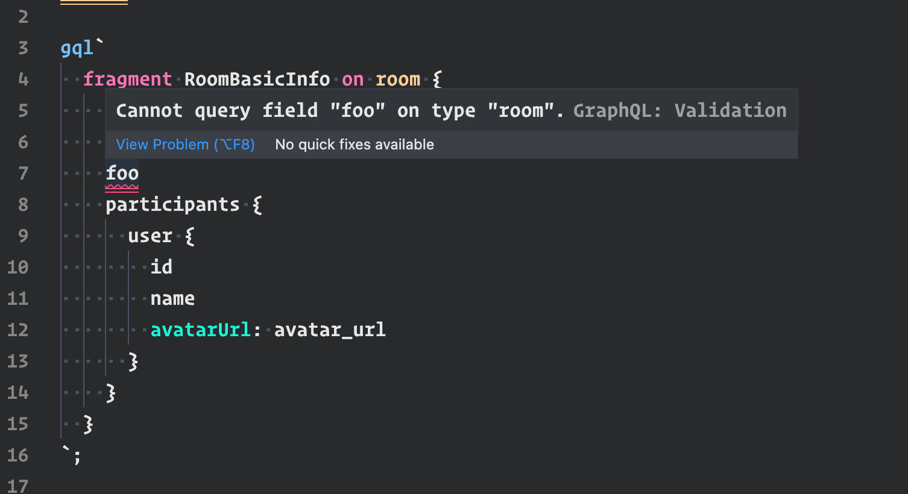
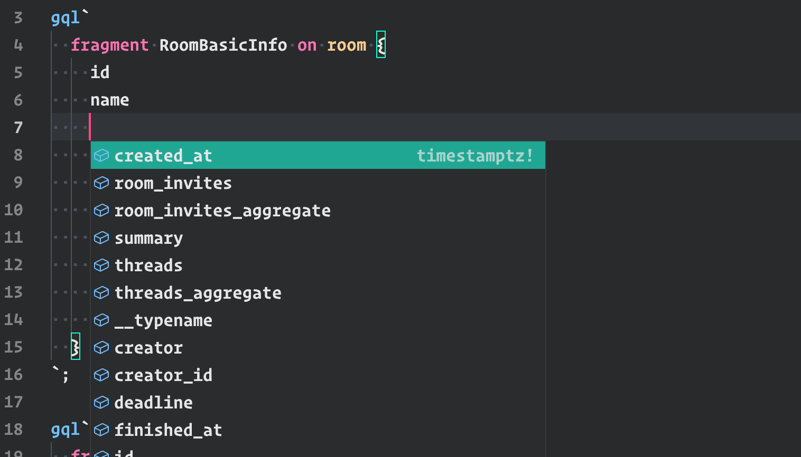

Hello there!

I hope getting started process will be as smooth and easy for you as possible!

Let's get it started.

## Monorepo

This monorepo includes everything needed to run our product on your laptop.

## Requirements

### Docker

You need to have docker and docker-compose installed on your machine. https://docs.docker.com/get-docker/

Make sure that docker is properly installed by calling `docker-compose --version` in your console.

### Node & NPM

npm version 7.0+ is required (the latest version is recommended) because this repo is based on npm workspaces.

Node version 15+ is recommended.

You can rely on nvm to pick the correct versions:

```shell
nvm install
```

You can enforce the latest npm version with:

```shell
nvm install --latest-npm
```

### `.env` file

Before running the project, you need to have proper config.

In root of this repo, copy `.env.sample` to `.env`.

After copying, your env is mostly ready for dev work. Ask other team members for missing values such as google oauth secrets etc.

### Finally!

After those steps, we should be good to go!

First - install all dependencies by running

`npm install`

After installed, the only command you have to remember should be `npm start`.

It will show you all other available commands as a console interactive select:


First, we need to seed the database:

- `hasura:migrations`
- `hasura:meta`

In order to bring the project up, run these commands in different terminals:

- `docker:up:m1`
- `frontend:dev`
- `backend:dev`

After that, go to http://localhost:3000, and you should see acapela app home.

## IDE

VS Code is the recommended IDE.

### Extensions

There is a bunch of extensions that will make it easier to work with this repo

#### ENV

Will add syntax highlighting for .env files.

VS Marketplace Link: https://marketplace.visualstudio.com/items?itemName=IronGeek.vscode-env

#### ESLint

We're using eslint, it'll make it possible to see eslint warning and errors in real-time

VS Marketplace Link: https://marketplace.visualstudio.com/items?itemName=dbaeumer.vscode-eslint

#### Prettier - Code formatter

We're using prettier for code-formatting. It'll format code after every file save.

VS Marketplace Link: https://marketplace.visualstudio.com/items?itemName=esbenp.prettier-vscode

#### vscode-styled-components

We're using styled-components for styling our UI. This will add syntax-highlighting and autocomplete for css-in-js

VS Marketplace Link: https://marketplace.visualstudio.com/items?itemName=diegolincoln.vscode-styled-components


#### GraphQL

This will provide validation and autocomplete when writing gql queries to make sure they match the current schema.

VS Marketplace Link: https://marketplace.visualstudio.com/items?itemName=GraphQL.vscode-graphql




## Commit Message Convention

This repository uses [`semantic-release`](https://github.com/semantic-release/go-semantic-release#how-does-it-work) for automatic releases.
That means it is necessary to stick to the [Conventional Commits](https://www.conventionalcommits.org/en/v1.0.0/) convention to trigger new releases.

### How to trigger releases?

#### Patch Release

```
fix(pencil): stop graphite breaking when too much pressure applied
```

#### ~~Minor~~ Feature Release

```
feat(pencil): add 'graphiteWidth' option
```

#### ~~Major~~ Breaking Release

```
perf(pencil): remove graphiteWidth option

BREAKING CHANGE: The graphiteWidth option has been removed. The default graphite width of 10mm is always used for performance reason.
```

[_More info_](https://github.com/conventional-changelog/conventional-changelog/tree/master/packages/conventional-changelog-angular)

### Using commitizen

This repository uses [commitizen](https://github.com/commitizen/cz-cli) to automate commit message composition.

All you need is to use `npx cz` command instead of `git commit` each time you are ready to commit anything. 
