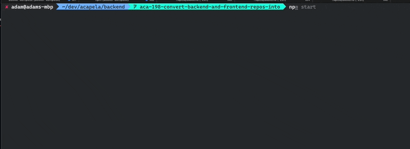

## Acapela Monorepo

Before setting up this repo, please read https://github.com/weareacapela/onboarding to get some better idea about our values and practices related to creating software.

Now, please head to Getting started guide in order to set up this repo on your machine.

[GETTING STARTED](./GETTING-STARTED.md)

---

Part below describes how this repo is organized and how to work with it.

README files for specific parts of this repo (frontend, backend) sits in corresponding folders of this monorepo.

README for packages:

- [Backend README](./backend/README.md)

- [Frontend README](./backend/README.md)

## Monorepo setup

This repo is based on npm workspaces (https://docs.npmjs.com/cli/v7/using-npm/workspaces).

### Terms

**Package** - single, npm-based part of this repo eg `frontend` and `backend`.

**Shared dependency** - Dependency which is used in the same version in every package.

### Shared dependencies

It is possible that the same dependency (eg `lodash`) is used across multiple packages using the same version.

In such case, dependency is added to root `package.json` (using `npm install package -S or -D`) at root folder and then added as `peer dependency` to packages using it with version `*`.

For example:

Let's say we want to use `react` version `17.0.0` in every package.

Root `package.json`

```json
  "dependencies": {
    "react": "^17.0.0"
  }
```

and then `frontend/package.json`

```json
  "peerDependencies": {
    "react": "*"
  }
```

### Versioning

Version of single packages (such as frontend or backend) should never be changed.

Version of root package can be freely changed if it makes sense for any use-case.

### Using one package inside another package.

Each package can import content of other package.

To do it, it needs to define package as its dependency

eg.

`utils/package.json`

```json
{
  "name": "@acapela/utils",
  "version": "0.1.0"
}
```

and then `frontend/package.json`

```json
{
  "dependencies": {
    "@acapela/utils": "0.1.0"
  }
}
```

In such a setup, after calling `npm install` - **symlink** will be created, meaning `./frontend/node_modules/@acapela/utils` is symlink to `./utils` (not clone!).

It also means that each change made inside `./utils` would be instantly reflected inside `./frontend/node_modules/@acapela/utils`.

### Dependencies typescript build pipeline

Note that packages like `./shared` have only typescript files and are never built ts > js by itself. (There is no `build` script for `./shared` alone).

Monorepo is organized in a way that forces package that uses `shared` to build it.

It means there is build setup only for 'end' packages (currently only frontend and backend).

In the frontend (next.js), we use proper next.js plugin to tell it to compile monorepo packages (`next-transpile-modules` - check `next.config.js` for more details).

In the backend, we use `@vercel/ncc` bundler for production build and `ts-node-dev` for development, both of which bundle correctly with zero additional config.

This setup means we have 'hot-reloading' experience when modifying any used monorepo package.

### Running scripts

It is possible to run scripts of every package from root folder of this repo.

Run `npm start` at root level to see possible a list of available scripts:



### Running commands in scope of single package

It's possible to manually run any command in the scope of a package.

The following script:

```bash
npm run frontend -- add react -S
```

is equal to

```bash
cd frontend
npm add react -S
```

Another example might be `npm run backend -- run test:watch`, etc.

## Shared configuration

### tsconfig

There is root level `tsconfig.json` file which is extended and modified if needed inside `<package>/tsconfig.json`

### eslint

Eslint config is in the root level and is used as-is in every package.

### gitignore

There is generic, node-based `.gitignore` at root level, but each package has its own `.gitignore`. Root one is kind of a backup.

### prettier

Prettier config is defined at root level and is used as-is in every package.
