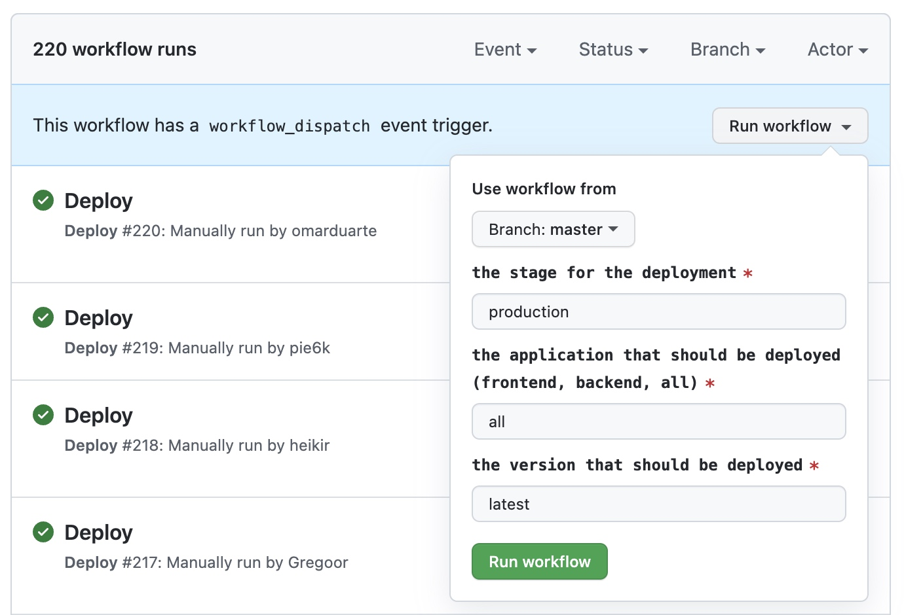

# Acapela

Before setting up this repo, please read https://github.com/weareacapela/onboarding to get some better idea about our values and practices related to creating software.

Now, please head to Getting started guide in order to set up this repo on your machine.

## Getting started

### Dependencies

- [Node](https://nodejs.org/en/)
  - Node version 16+ is required
  - You **can** use [NVM](https://github.com/nvm-sh/nvm) to manage different Node versions on your system
- [yarn](https://classic.yarnpkg.com/en/docs/install/#mac-stable)
  - To install yarn, call `npm install --global yarn`
- [Docker](https://docs.docker.com/get-docker/)
  - Make sure that docker is properly installed by calling `docker compose version` in your console.

### `.env`

Before running the project, you need to have proper config.

In root of this repo, copy `.env.sample` to `.env`.

After copying, your env is mostly ready for dev work. Ask other team members for missing values such as google oauth secrets etc.

### Install

After those steps, we should be good to go!

First - install all dependencies by running

```sh
yarn install
```

To start all the required services, in the correct order you can **either** run:

```sh
yarn dev
```

**For the first run** you should run these commands separately to make sure every step works as expected.

or run the commands separately, here are the most important ones and what they mean:

| Command              | Description                                                                |
| -------------------- | -------------------------------------------------------------------------- |
| `yarn docker:up`     | Starts a Docker container with PostgreSQL and Hasura running               |
| `yarn hasura:update` | Runs migrations and metadata updates on Hasura                             |
| `yarn generate`      | Updates Prisma & GraphQL schemas (needs to be re-run on db schema changes) |
| `yarn backend:dev`   | Starts the Backend server                                                  |
| `yarn frontend:dev`  | Starts the Next.JS server                                                  |

After starting all the services, you can go to http://localhost:3000, and you should see Acapela running on your machine.

If you want to see all available commands from the root `package.json`, you can run `yarn start`.


## Hasura setup

We use [Hasura](https://hasura.io/) to generate a GraphQL API with permission for our PostgreSQL database.

To modify the database schema or access rules or other configurations use the hasura console (run `yarn hasura:console` to open it).
This automatically creates migrations. [You can squash the migrations, using the hasura cli, into a single logical migration](https://hasura.io/docs/latest/graphql/core/hasura-cli/hasura_migrate_squash.html)

## Ngrok

We use ngrok to expose our backend to the internet. Get an invite into our premium account from one of our team mates, then navigate to https://dashboard.ngrok.com/get-started/your-authtoken

Add the authtoken from the Ngrok dashboard into your `.env` as `NGROK_AUTH_TOKEN`, with a `NGROK_SUBDOMAIN` of your choosing. The domain needs to be unique, and only used on one machine at a time, otherwise the tunnel will crash on startup.

## Integrations

### Stripe

Get yourself an invite to our Stripe account from one of our team members. Otherwise, you can also create an account for yourself. Make sure to create two products, one for the `premium` plan and one for the `business plan`.

1. Copy the **price** (not product) ids into your `.env` as `STRIPE_PRICE_PREMIUM_ID` and `STRIPE_PRICE_BUSINESS_ID`
2. Copy the secret key from [here](https://dashboard.stripe.com/test/apikeys) into your `.env` as `STRIPE_SECRET_KEY`
3. Head over [here](https://dashboard.stripe.com/test/webhooks), create a webhook
   1. Use your ngrok domain for the endpoint URL e.g. `https://gregapela.ngrok.io/api/backend/v1/stripe/webhook`
   2. For now we only need to listen to the `customer.subscription.created` event
   3. After adding the endpoint, copy its signing secret into your `.env` as `STRIPE_WEBHOOK_SECRET`

### Slack

Setting Slack up is optional in development, but if you want to work on it you have to set-up your own Slack app.

1. Run `yarn shared clone-slack-manifest`
   1. Make sure to use the `NGROK_SUBDOMAIN` defined above
2. Go to https://api.slack.com/apps?new_app=1 and choose the second option to use the manifest to create a new app
3. Make sure to give it a unique name and command name (which also should be unique within our workspace)
4. Head to "Basic Information" and find the "App-Level Tokens", where you will want to click "Generate token", give it a name of your choosing and add the `authorizations:read` scope. You will need the token in the next step.
5. Fill out `SLACK_CLIENT_ID`, `SLACK_CLIENT_SECRET`, `SLACK_SIGNING_SECRET`, `SLACK_APP_TOKEN` and `SLACK_SLASH_COMMAND`. in your `.env`, based on your new app's info. Also add `SLACK_STATE_SECRET` which can be any random string.
6. To start using Slack's actions, open the frontend, navigate to a team's settings page and click the button for linking the team to Slack.
7. Need to test working with multiple workspaces? You need to go to your Slack App Settings > Manage Distribution > Make App Public.

#### Updating testing/staging/production Slack App manifest

1. Copy the manifest
   1. **For testing:** Run `yarn shared clone-slack-manifest --testing`
   1. **For staging:** Run `yarn shared clone-slack-manifest --staging`
   1. **For production:** Just copy `shared/slack/manifest.json`
2. Paste the manifest into the [testing](https://app.slack.com/app-settings/T01DBMUNM5H/A02RDDW5G3C/app-manifest), [staging](https://app.slack.com/app-settings/T01DBMUNM5H/A02CFBKDZMZ/app-manifest) or the [production](https://app.slack.com/app-settings/T01DBMUNM5H/A012VTBSTNV/app-manifest) app and save it.

### Linear

Similar to the slack integration, setting up Linear is optional in development.

1. Go to https://linear.app/acapela/settings/api/applications/new
2. Use your own name as part of the app name to make it easily distinguishable
3. Set the callback url to `http://localhost:3000/api/backend/v1/linear/callback`
4. Make sure to enable webhooks for `Issues` and `Issue comments`
5. Set the webhook url to `https://<replace-this-with-your-cool-tunnel-name>.ngrok.io/api/backend/v1/linear/webhook`
6. Fill out `LINEAR_CLIENT_ID`, `LINEAR_CLIENT_SECRET`, in your `.env`, based on your new app's info. Also add `LINEAR_OAUTH_SECRET` which can be any random string.

### Atlassian Jira

1. Go to https://developer.atlassian.com/apps/ and create an OAuth app
2. Within your newly created Atlassian app
   1. Go to Authorization/Configure and set the Callback URL to http://localhost:3000/api/auth/callback/atlassian
   2. Go to Settings and get values for your `.env` keys `ATLASSIAN_CLIENT_ID` and `ATLASSIAN_CLIENT_SECRET`
3. There's a grueling step in which you need to add a whole lot of permissions. This has to be done manually.
   The best source of truth is `frontend/pages/api/auth/[...nextauth].ts`. Here the `AtlassianProvider` has defined many
   scopes, and most of these need to be added as permissions to the app.

   Here's the breakdown of these scopes:

   - `offline_access` not needed in the app. This is used to `get a refresh token in your initial authorization flow`
   - `read:me` can be found in `Permissions` -> `User identity API`
   - `*:jira` can be found in `Permissions` -> `Jira API`

### GitHub

1. Setup a new GitHub app using [this link](https://github.com/settings/apps/new?name=my-cool-acapela&url=https://acapela.com&callback_urls[]=http://localhost:3000/api/backend/v1/github/callback&webhook_active=true&webhook_url=https://my-acapela.ngrok.io/api/backend/v1/github/webhook&request_oauth_on_install=true&public=true&issues=read&metadata=read&pull_requests=read&members=read&events[]=issues&events[]=issue_comment&events[]=pull_request&events[]=organization&events[]=repository&events[]=member&events[]=meta) and update your ngrok endpoint.
2. Generate a new client secret and configure `GITHUB_CLIENT_SECRET`
3. Generate a new private key
   1. Encode the private key to base64 using `cat my-cool-acapela.private-key.pem | base64 -w 0`
   2. Configure `GITHUB_APP_PRIVATE_KEY`
4. Configure a webhook secret and set `GITHUB_WEBHOOK_SECRET`
5. Make sure you also configure `GITHUB_CLIENT_ID`, `GITHUB_APP_ID` and `GITHUB_APP_NAME` correctly
6. Set up an OAuth app using [this link](https://github.com/settings/applications/new?oauth_application[callback_url]=http://localhost:3000/api/backend/v1/github/callback)
   1. Configure `GITHUB_ONBOARDING_OAUTH_CLIENT_ID` and `GITHUB_ONBOARDING_OAUTH_CLIENT_SECRET`

### Asana

1. Setup a new Asana App [here](https://app.asana.com/0/my-apps).
2. Find the client secret and the client id in the OAuth settings and configure `ASANA_CLIENT_SECRET` and `ASANA_CLIENT_ID`.
3. Set the redirect URL to `http://localhost:3000/api/backend/v1/asana/callback`

### ClickUp

1. Setup a new ClickUp API App [here](https://app.clickup.com/36710838/settings/team/36710838/integrations?integration=api).
2. Set the app name and set the redirect URL to `localhost:3000`.
3. Configure `CLICKUP_CLIENT_ID` and `CLICKUP_CLIENT_SECRET` with the provided client id and client secret.

### Gmail

Get a Google service account key JSON file, through the console or from your colleagues. Specifiy its path in `GOOGLE_APPLICATION_CREDENTIALS`.

1. Head over to our a topic within Google's PubSub (for example https://console.cloud.google.com/cloudpubsub/topic/detail/acapela-gmails-dev?project=meetnomoreapp) and create a new subscription for it.
2. Set the `GMAIL_TOPIC_NAME` and `GMAIL_SUBSCRIPTION_NAME`
3. Make sure the newly created subscription has all the necessary permissions, which you can do by comparing it with our [dev subscription](https://console.cloud.google.com/cloudpubsub/subscription/detail/acapela-gmails-dev-sub?project=meetnomoreapp) (click "Show info panel" to see the permissions)

## Commit Message Convention

This repository uses [`semantic-release`](https://github.com/semantic-release/go-semantic-release#how-does-it-work) for automatic releases.
That means it is necessary to stick to the [Conventional Commits](https://www.conventionalcommits.org/en/v1.0.0/) convention to trigger new releases.

### How to trigger releases?

A new release gets triggered automatically after a push to master. The version numbers get incemented automatically depending on the commit message prefixes in the merged branch.

#### Patch Release

```
fix(pencil): stop graphite breaking when too much pressure applied
```

#### ~~Minor~~ Feature Release

```
feat(pencil): add 'graphiteWidth' option
```

#### ~~Major~~ Breaking Release

```
perf(pencil): remove graphiteWidth option

BREAKING CHANGE: The graphiteWidth option has been removed. The default graphite width of 10mm is always used for performance reason.
```

[_More info_](https://github.com/conventional-changelog/conventional-changelog/tree/master/packages/conventional-changelog-angular)

### Using commitizen

This repository uses [commitizen](https://github.com/commitizen/cz-cli) to automate commit message composition.

All you need is to use `npx cz` command instead of `git commit` each time you are ready to commit anything.

## Monorepo setup

This repo is based on workspaces (https://classic.yarnpkg.com/en/docs/workspaces/).

### Terms

**Package** - single, package.json-based part of this repo eg `frontend` and `backend`.

**Shared dependency** - Dependency which is used in the same version in every package.

### Shared dependencies

It is possible that the same dependency (eg `lodash`) is used across multiple packages using the same version.

In such case, dependency is added to root `package.json` (using `yarn add package -S or -D`) at root folder and then added as `peer dependency` to packages using it with version `*`.

For example:

Let's say we want to use `react` version `17.0.0` in every package.

Root `package.json`

```json
  "dependencies": {
    "react": "^17.0.0"
  }
```

and then `frontend/package.json`

```json
  "peerDependencies": {
    "react": "*"
  }
```

### Versioning

Version of single packages (such as frontend or backend) should never be changed.

Version of root package can be freely changed if it makes sense for any use-case.

### Using one package inside another package.

Each package can import content of other package.

To do it, it needs to define package as its dependency

eg.

`utils/package.json`

```json
{
  "name": "@aca/utils",
  "version": "0.1.0"
}
```

and then `frontend/package.json`

```json
{
  "dependencies": {
    "@aca/utils": "0.1.0"
  }
}
```

In such a setup, after calling `yarn install` - **symlink** will be created, meaning `./frontend/node_modules/@aca/utils` is symlink to `./utils` (not clone!).

It also means that each change made inside `./utils` would be instantly reflected inside `./frontend/node_modules/@aca/utils`.

### Dependencies typescript build pipeline

Note that packages like `./shared` have only typescript files and are never built ts > js by itself. (There is no `build` script for `./shared` alone).

Monorepo is organized in a way that forces package that uses `shared` to build it.

It means there is build setup only for 'end' packages (currently only frontend and backend).

In the frontend (next.js), we use proper next.js plugin to tell it to compile monorepo packages (`next-transpile-modules` - check `next.config.js` for more details).

This setup means we have 'hot-reloading' experience when modifying any used monorepo package.

### Running commands in scope of single package

It's possible to manually run any command in the scope of a package.

```bash
yarn frontend add react
```

Another example might be `yarn backend test:watch`, etc.

## Migrations

When making mutative (i.e. non-additive) changes to the database schema it is important to do it in a staggered fashion. The recommended order of operation is:

1. ClientDb entity fragment
   1. By still keeping it in the server we make sure older clients still work, though we are not generally trying to stay backwards compatible for too long
2. Hasura metadata
   1. This prevents a failed metadata update (e.g. due to a deadlock) to leave metadata in an inconsistent state. We run migrations before the metadata refresh and this is unfortunately not a single transaction.
3. Actual database schema migration

It's recommended to space deploying these changes out over some time. Create yourself linear issues with deadlines to remember when to kick off the next phase.

## Shared configuration

### tsconfig

There is root level `tsconfig.json` file which is extended and modified if needed inside `<package>/tsconfig.json`

### eslint

Eslint config is in the root level and is used as-is in every package.

### gitignore

There is generic, node-based `.gitignore` at root level, but each package has its own `.gitignore`. Root one is kind of a backup.

### prettier

Prettier config is defined at root level and is used as-is in every package.

## Deployment

- Staging is automatically updated after every release on master.
- Production releases require manual deployment. This is done by using the custom [deploy workflow](https://github.com/weareacapela/monorepo/actions/workflows/deploy.yaml) in GitHub Actions.



After clicking on run workflow you can specify the stage, the application, and the version to deploy.

The application value `all` releases the desktop app and deploys the frontend and backend application.
If the application value is only set to `backend` the script will only update the backend service without creating a new releases of the desktop app.

The version value `latest` will deploy the latest release. To deploy a specific version you can pass here the exact version number (e.g. `1.2.3`).
