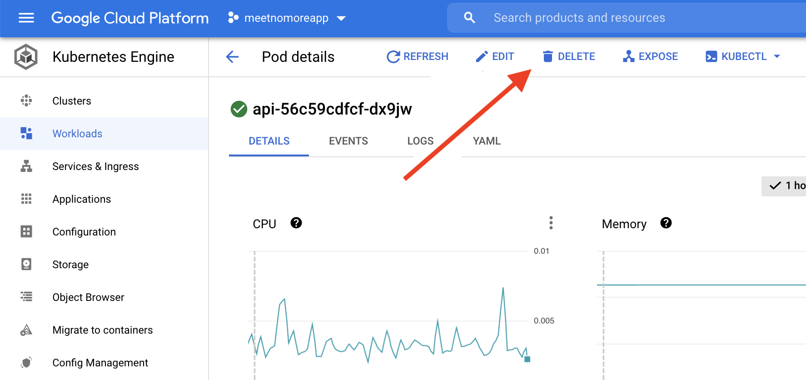

# The Kubernetes infrastructure

The current setup of our Kubernetes infrastructure is a single cluster with two nodes. It can be managed directly via the Google Cloud Platform console.

## Monitoring

We currently use Google Cloud Monitoring: https://console.cloud.google.com/monitoring/uptime

## Cluster access

1. Make sure you have the [`gcloud`](https://cloud.google.com/sdk/docs/install), [`kubectl`](https://kubernetes.io/docs/tasks/tools/) and [`kustomize`](https://kubectl.docs.kubernetes.io/installation/kustomize/) command line utilities installed.
2. Setup kubectl to access the cluster
   - To retrieve/refresh credentials run this: `gcloud container clusters get-credentials cluster-1`
   - To verify access try to list pods: `kubectl get pods -n [staging|production]`

## Namespaces

To differentiate between our staging and production environment, we created two different namespaces which are fully isolated from each other.
This repository also includes helper aliases to simplify the namespace access. They can be loaded with the following command:

```bash
. .aliases
```

This will enable the `kkstaging` alias that behaves exactly like `kubctl` with the namespace staging set and the `kkprod` alias that sets the production namespace.

Example usage of the aliases:

```bash
kkstaging get pods
kkprod get services
```

## Resources

The following resources currently exist in this repository:

| Resource | Description                         | Automatic deployment | Staging Endpoint / IP                                                                        | Production Endpoint / IP               |
| -------- | ----------------------------------- | -------------------- | -------------------------------------------------------------------------------------------- | -------------------------------------- |
| api      | monorepo/backend deployment config  | yes                  | internal                                                                                     | internal                               |
| frontend | monorepo/frontend deployment config | yes                  | [app-staging.acape.la](https://app-staging.acape.la)<br>[dev.acape.la](https://dev.acape.la) | [app.acape.la](https://app.acape.la)   |
| hasura   | the hasura backend                  | no                   | `yarn hasura:console:proxy staging`                                                          | `yarn hasura:console:proxy production` |
| ingress  | handles all incoming traffic        | no                   | 34.117.218.52                                                                                | 35.241.35.179                          |

Furthermore, the `iam` and `namespaces` folders contain resources that were initially used to configure the cluster.

### Resources with automatic deployment

These resources will be automatically applied when a new release in the monorepo is created.

### Resources with no automatic deployment

These resources need to be applied manually:

```bash
kustomize build hasura/[staging|production] | kubectl apply -f -
```

### Environment configuration

The environment config for the different resources can be changed by editing the `*.env` files.
Secrets need to be added to [Google Secrets Manager](https://console.cloud.google.com/security/secret-manager?orgonly=true&project=meetnomoreapp&supportedpurview=organizationId) first with the correct stage as prefix (e.g `staging-my-supercool-secret`).
The secrets then can be accessed using the following schema as value: `sm://meetnomoreapp/staging-my-supercool-secret`
Internally the tool [`berglas`](https://github.com/GoogleCloudPlatform/berglas) is used to retrieve these secrets during runtime.

# Hasura

We use a custom hasura image to enable Google Secrets Manager support. The used Dockerfile can be found at [./docker/graphql-engine/Dockerfile](./docker/graphql-engine/Dockerfile).

# Useful commands

```bash
# list all running pods
kkstaging get pods

# show latest logs of the api pod backend container
kkstaging logs api-xxxxxx backend

# show api deployment info
kkstaging describe deployments api

# show the staging ingress configuration
kkstaging describe ingress default
```

# Handling production infrastructure issues

We have often seen issues with particular nodes affecting the uptime of production infrastructure. The first step is to
identify the failing deployment over in the [Kubernetes Engine Workloads overview](https://console.cloud.google.com/kubernetes/workload/overview?project=meetnomoreapp).
Once identified, click into it to see the _Deployment details_, you can click into it and try manually deleting the
failing pod (no worries, a new one should be re-created soon thereafter). To do that scroll to the _Managed pods_
section and click on the pod which is indicated as failing in the _Status_ column. On the _Pod details_ page you can
then click on the _Delete_ button: 

If deleting the pod does not work, or it takes to long, you can also navigate back to the _Deployment details_ page and
delete the whole deployment. **This action will not lead to auto-recovery**, but instead you will have to trigger a new
release from the [_Deploy_ action over in GitHub](https://github.com/acapela/monorepo/actions/workflows/deploy.yaml).
You can choose the same version that was already deployed, if you don't want to upgrade.

From both the _Deployment details_ and _Pod details_ page you can also see the _Logs_ section which is invaluable to
identify the exact cause of the failure, and a must both for learning from the failure and hopefully preventing it from
reoccurring.
